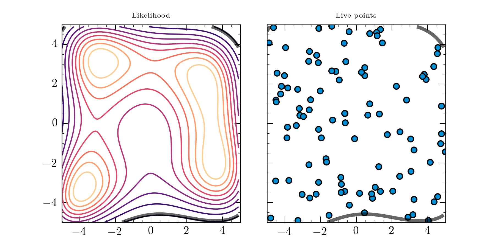

<!--  -->

<!-- _class: titlepage -->

# Evidence is all you need
## Nested Sampling for Lattice Field Theory
### David Yallup (<dy297@cam.ac.uk>)
#### 24th Feb 2023
##### UKLFT meeting

Live slides with animation available:
[[yallup.github.io/uklft]](https://yallup.github.io/uklft) 

----
<!-- paginate: true -->

<!-- _class: invert lead -->

# __info__

----

### Himmelblau function

$$

f(x) \propto -\exp [(x^2 + y -11)^2 + \\ (x + y^2 -7)^2]

$$

Multimodal function, (exponential of square ~ Gaussian)

Four identical local maxima

----

----

----

<!-- _class: invert lead -->

# __Conclusion__

## Thanks for listening

