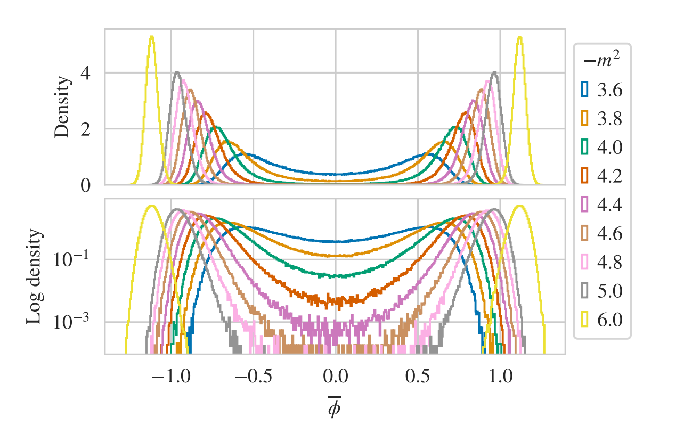
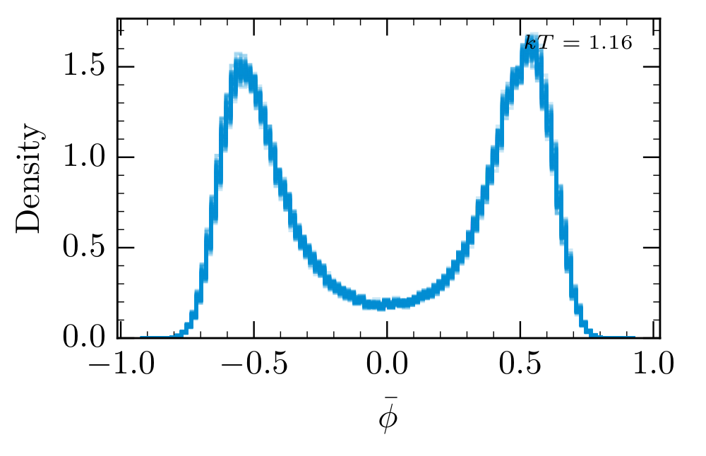

<!--  -->

<!-- _class: titlepage -->

# Nested Sampling for Lattice Field Theory
### David Yallup (<dy297@cam.ac.uk>)
#### 27th March 2023
##### UKLFT meeting

Live slides with animation available:
[[yallup.github.io/uklft]](https://yallup.github.io/uklft) 

----
<!-- paginate: true -->

## Nested Sampling

Technique for computation of multidimensional integrals [[Ashton et al - Nature review paper]](https://arxiv.org/abs/2205.15570)
> Widespread adoption in Bayesian evidence integrals 

$$ P(\theta | X) = \frac{\mathcal{L}(X | \theta)\times \Pi(\theta) }{Z}\, $$
$$ Z(\beta) = \int D\theta \mathcal{L}(X | \theta)\Pi(\theta) $$

Cambridge Cosmology (KICC and Cavendish AP) one of the driving forces in development: 
$+$ DY (Inference and ML applications) 
$+$ Will Barker (Gravity on the lattice)
$+$ Will Handley (all of the above)
$+$ Boris Deletic (Part III student, gradients in NS)

----
### What does this bring to the table

Rather than a ensemble of chains, construct a chain of ensembles
[[Original paper - Skilling]](https://projecteuclid.org/journals/bayesian-analysis/volume-1/issue-4/Nested-sampling-for-general-Bayesian-computation/10.1214/06-BA127.full)
[[Our implementation, PolyChord - Handley et al]](https://arxiv.org/abs/1506.00171)

<!--  -->

 

$$
f(x) \propto -\exp [(x^2 + y -11)^2 + \\ (x + y^2 -7)^2]
$$

----
### Non Bayesian inference example
#### Matrix elements @ LHC

Pose phase space integration as [[2205.02030]](https://arxiv.org/abs/2205.02030)
$$ \sigma = \int\limits_\Omega d\Phi |\mathcal{M}|^2 (\Phi)\, $$
$$ \mathcal{Z} = \int d\theta \mathcal{L} (\theta) \Pi (\theta)\, $$
Explore scale choice as model comparison problem 
__nb:__ ME as Likelihood, __not__ fitting to data

----

### Lattices and Machine Learning

Interest in ML methods to overcome/complement difficulties with HMC

"Flow-based sampling for multimodal distributions in lattice field theory" [[2107.00734]](https://arxiv.org/abs/2107.00734)

$$
S_E(\phi) = \sum_x (  \sum^D_{\mu=1} \frac{1}{2}(\phi(x+\hat{\mu}) -  \phi(x))^2+ \frac{1}{2} m^2 \phi(x)^2 + \lambda \phi(x)^4)
$$

<!-- $\phi^4$ scalar lagrangian with wrong sign (higgs) mass potential -->
Sample on 2D, $10\times10$ lattice

  

NFs learn mapping of prior $\rightarrow$ posterior, Nested sampling compresses prior $\rightarrow$ posterior. Roughly shared dimension limitations, shared promises...

----
#### Nested sampling simple lattices

Same scalar $\phi^4$ theory on $10\times10$ lattice as previous slide. NS computes partition function,

$$
    Z(\beta)= \int D\phi ~e^{-\beta S(\phi)}, \quad \beta=\frac{1}{kT}
$$

* The density of states (prior volume estimation) is the missing piece in
inference, normally avoided/cancelled in traditional methods.
* The sampling process is athermal, and invariant under monotonic
transformations of the sampled distribution
* Clustering can be inserted at runtime

  

By appropriate re-weighting, we can post-process the posterior samples to be at any temperature.

----

